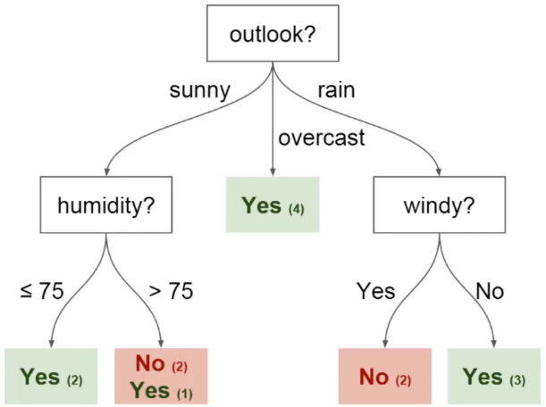

# Decision Trees

> *The mathematical aspect of decision trees can be found in chapter 8 of **An Introduction to Statistical Learning** by Gareth James, Daniela Witten Trevor Hastie and Robert Tibshirani. `page 327`*

## Introduction

### Decision trees

In order to understand what decision trees are and how we can use decision trees as algorithms, let's start with a little thought experiment.

Let's imagine that play tennis every Saturday and that I always invite a friend to come with me. Sometimes my friend shows up, sometimes he doesn't. For him showing up depends on a variety of factors, such as the weather, temperature, humidity, wind, etc...

Let's imagine that I start keeping track of these features and whether or not he showed up to play with me.

I can now use this data to build a **decision tree** to determine if he's going to show up or not.

In this decision tree we have:

- **Nodes**: nodes split for the value of a certain attribute. In this example we have an  `Outlook` node, a `Humidity` node and a `Wind` node.
- **Edges**: edges are the outcome of a split to the next node.
- **Root**: also called root node. It is the node that performs the first split. In this example it would be the `Outlook` feature.
- **Leaves**: leaves are the terminal nodes that predict the outcome. In our example, they have been colored in green and red.

As we can see, choosing the right features for the nodes is capital in order to maximize the information gain off of a single split.

For example if we have three features `X`, `Y` and `Z`, and a classification as `A` or `B` organized as follows:

|  X   |  Y   |  Z   | Class |
| :--: | :--: | :--: | :---: |
|  1   |  1   |  1   |   A   |
|  1   |  1   |  0   |   A   |
|  0   |  0   |  1   |   B   |
|  1   |  0   |  0   |   B   |

We can see that if we were to choose any other feature than `Y` for our split, we would lose information gain as we can infer the class from the Y column alone.

### Random Forests

Random forests are a way to improve performance off single decision trees. One inherent weakness of decision trees is that they don't have a high predictive accuracy. This is mainly due to the *high variance*, meaning that different splits in the training data can lead to very different trees.

[**Bagging**](https://youtu.be/RtrBtAKwcxQ) is a general procedure for reducing the variance of machine learning methods. We can build of the idea of bagging by using the idea of **Forests**.

[Here](https://youtu.be/7C_YpudYtw8) is an interesting video of ***Ensemble Learning*** in French.