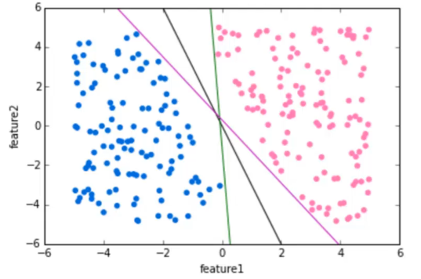

# Support Vector Machines

> The mathematics behind Support Vector Machines or SVM can be found in Chapter 9 of the Introduction to Statistical Learning.

## Definition

Support vector Machines or SVMs are supervised learning models with associated learning algorithms that analyze data and recognize patterns, used for classification and regression analysis.

Given a set of training examples, each marked for belonging to one of two categories (binary classification), an SVM training algorithm builds a model that assigns *new examples* (= test data points) into one category or the other ,making it a ***non-probabilistic binary linear classifier***.

An SVM model is a representation of the examples (= training data points) as points in space, mapped so that the examples of the separate categories are divided by a clear gap that is as wide as possible. New examples are then mapped into that same space and predicted to belong to a category based on which side of the gap they fall on.

To do so, the model wants to choose an hyperplane that will define which class the example belongs to by looking at which side of the hyperplane the example is located. However, many hyperplanes are possible. Since the 'gap' between both classes need to be as wide as possible, the hyperplane needs to be as far apart from both categories of the training set as possible. That **maximizes the margin** between classes.

######  

The points that the margin lines touch are known as ***support vectors**. That's where the name Support Vector Machine comes from.

We can expand this idea to **non-linearly separable data** through the `kernel trick` (see chapter 9).

