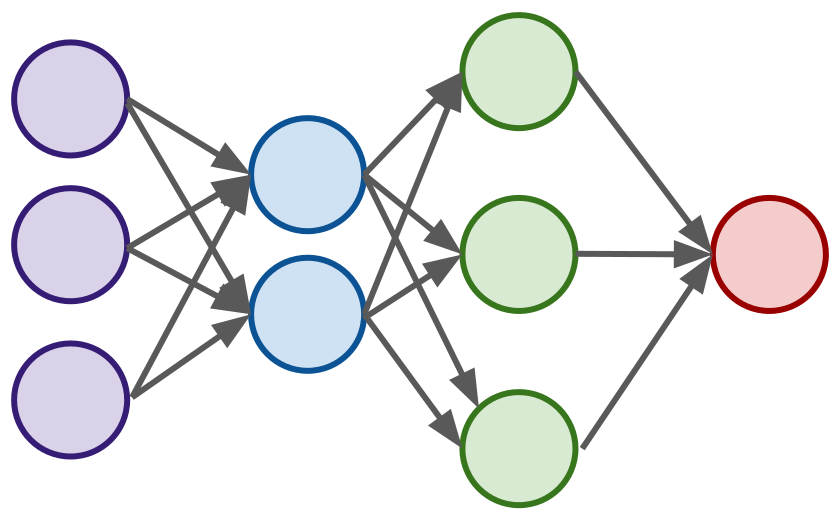
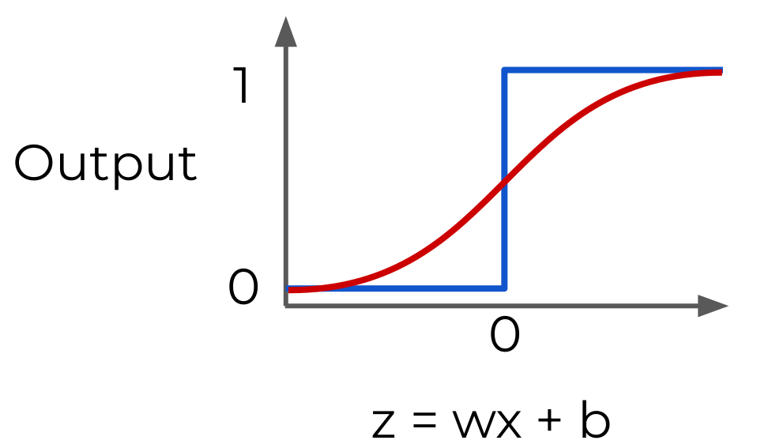
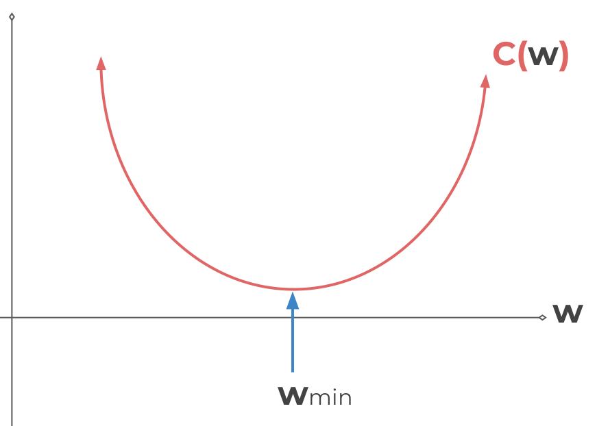
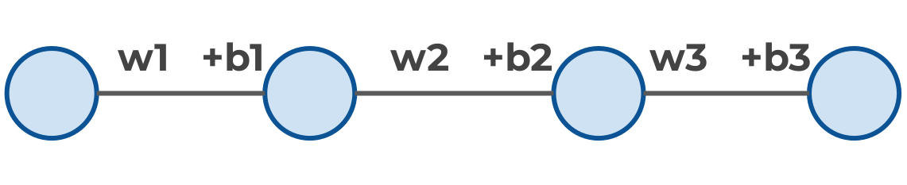

# Neural Networks and Deep Learning

One of the main libraries for Artificial Neural Networks (or ANN) is **[Tensorflow](https://www.tensorflow.org/install)**. Tensorflow can be used in a multitude of ways. Either locally, or via a container or even online on a shared machine.

To understand what deep learning is, we will first try to build up our model abstractions. First we will have a look at what a single biological neuron looks like. Then we will model them mathematically as a single perceptron. Afterwards we will try to group perceptrons (or artificial neurons) together in a multi-layer perceptron model. And finally we will try to expand this to a deep learning neural network.

To be able to grasp what we are doing, we will need to learn about some key mathematical concepts like *Activation Functions*, *Gradient Descent* or *BackPropagation*.

## Local Installation

> [Official Installation Documentation](https://www.tensorflow.org/install/pip)

```bash
# TensorFlow2 requires pip version > 19.0
pip install --upgrade pip # if necessary

# GPU setup (optional)
# ----------------------------

# Install NVIDIA GPU driver

# Install CUDA and cuDNN
conda install -c conda-forge cudatoolkit=11.2 cudnn=8.1.0

# Set path (should be done each time we start a new terminal)
export LD_LIBRARY_PATH=$LD_LIBRARY_PATH:$CONDA_PREFIX/lib/
# OR
# Automate
mkdir -p $CONDA_PREFIX/etc/conda/activate.d
echo 'export LD_LIBRARY_PATH=$LD_LIBRARY_PATH:$CONDA_PREFIX/lib/' > $CONDA_PREFIX/etc/conda/activate.d/env_vars.sh

# Install TensorFlow
# -----------------------------
pip install tensorflow
```


## Perceptron Model

The whole idea behind deep learning is to have computers artificially mimic biological natural intelligence. This is why we should first get a general understanding of how biological neurons work.

### How do biological neurons work?

If we (really, really) simplify what a neuron is, we can say that a neuron is composed of:

- Dendrites: They are the inputs of the neuron
- Nucleus: The main central unit of the neuron
- Axon: The output of the neuron

So even though we know that this is biologically not really accurate, we can say that a neuron is a unit that takes in inputs. These inputs can come from a variety of sources. The inputs are used to do something (for the parallel with computing, we say some calculations) in the Nucleus and then it outputs the result of that something through the Axon.

### How can we convert biology into a mathematical model?

The idea of a perceptron is not new. It dates back to 1958 when Frank Rosenblatt identified the perceptron as the technology that could learn, make decisions and translate languages. However, in the late 60's the book ***Perceptrons*** by Marvin Minsky and Seymour Papert showed the limitation of what perceptrons could do. These limitations were mainly due to the required computational power required for multi-layer perceptron networks.

Us, however, we live in an age with enough computational power to create and run neural networks that stem back to the perceptron model of 1958.

Ok. But it doesn't answer the question. How do we convert a neuron into a mathematical model?

First, we remove the idea of dendrites, nucleus and axon and replace them with **inputs**, the **neuron** and a **single output**.<br/>If I give my perceptron two inputs (`x1` and `x2`), the neuron should execute some kind of function (`f(x)`) to output a value `y`. For example, if `f(x)` is a simple sum, then `y = x1 + x2`.

Now, ideally, we want to be able to adjust the parameters in order for our perceptron to "learn". Currently our model is not able to adjust the value of `y`. That is why we will add **adjustable weights** (`w1` and `w2`) that will multiply the value of `x1` and `x2`. Our simple sum now looks like this: `y = (x1 * w1) + (x2 * w2)`.

It is now possible to update the weights in order to affect the output `y`. But what about if `x = 0`. We can adjust the weights all we want, the product will always be 0 and our adjustable weight will have no impact.<br/>That's why we add a **bias** (`b`) to the inputs. A good way to think about biases is that the product of `x` and `w` needs to overcome the value of `b` in order to influence the value of `y`. Now our simple sum look a bit more complex: `y = (x1w1 + b) + (x2w2 + b)`

Keep in mind that both weights and biases can be both **positive** or **negative**. Also it is possible to expand this idea to a generalization with `x1, x2, x3, ..., xn` and `w1, w2, w3, ..., wn`. As such we can create a generalized mathematical model of our perceptron:
$$
\hat{y} = \sum_{i=1}^n x_iw_i + b_i
$$

## Neural Network

A single perceptron is not enough to learn complicated systems. That is why we are trying to create a multi-layer perceptron model. This multi-layer perceptron model is called a basic artificial **Neural Network**.

To create a neural network from the idea of a single perceptron, we build a network of perceptrons where we connect layers of perceptrons using what is known as the **multi-layer perceptron model**.



What does this entail ? We have a *vertical layer* of single perceptrons (or neurons). We take the output of this layer of neurons and feeds it as input to the next vertical layer of neurons.<br/>On the picture above, please note that each output is connected to all the inputs of all the neurons on the following layer. This is what is called a **fully connected layer**.

These connections allow the network as a whole to learn about interactions and relationships between features.

### The different layers

The first layer (in purple) is called the **input layer **. This layer is the one that receives (or is in direct contact with) the raw input data.

The last layer  (in red) is called the **output layer**. The output layer can be more than one neuron, especially when we are dealing with multi-class classification.

Every layer in between the input layer and the output layer is called a **hidden layer**. Hidden layers are difficult to interpret due to their high interconnectivity and their distance away from known input or output values.

A Neural Network becomes a **Deep Neural Network** if it contains **2 or more hidden layers**.

#### Trivia

An interesting feature of a neural network framework is that it can be used to approximate any continuous function. This has been proven by Zhou Lu and later by Boris Hanin.

More information about this can be found [here](https://en.wikipedia.org/wiki/Universal_approximation_theorem).

### Connecting the dots

In our example, we had a neuron with a simple sum. However, this example is obviously not very useful for, let's say, classification tasks.

In that case we want the output of our neuron to be located somewhere between 0 and 1 to represent a percentage of assignment for each class.

So we need to be thinking of *what functions can we apply to those `inputs x weights + biases` to put constraints (or upper and lower limits) to the resulting output*. These functions are called **activation functions**.

## Activation Functions

In our perceptron example above, our inputs `x` have a weight `w` and a bias term `b` attached to them. We can think of the weight as the *importance* of a feature of input. The greater this importance, the more weight its related input will have in the output of the function.

We have explained that `b` can be thought of as an *offset value* making `x * w` have to reach a certain threshold before having an effect.

Now as we have seen, activation functions are *boundaries* for the overall value of the function. So if `y` is the output of a neuron, then `z` is the output of the *sum* function of our neuron. Up to here, we defined our neuron in the following way:
$$
\hat{y} = \hat{z} = \sum_{i=1}^n x_iw_i + b_i
$$
But with an activation function, `z = xw + b` and then `z` passes through an activation function that limits its value. And a lot of research has been done into activation functions and their effectiveness. This means that there are now common activation functions that we can try out.

### Quick note on notation

To avoid confusion:

- `z` is the total inputs as a variable such that `z = wx +b`
- This means that the activation function is `f(z)`
- In documentation or literature, we often find these variables capitalized as `f(Z)` or `f(X)` to indicate a **tensor input** consisting of multiple values.

### Basic step function

For a binary classification, a neuron could, for example return either a 0 or a 1. So dependent of the value of `z` the activation function will output 0 or 1. In the blue graph below, if `z` is inferior to 0, it will output 0, if `z` is superior to 0 it will output 1.

Now the problem here is that we have a very strong cut-off that *immediately* splits between 0 and 1. As the world is rarely that clear-cut, it might be interesting to have a little more nuance. Which is why we can smoothen down this curve using a sigmoid function or logistic function for example.


$$
\text{Sigmoid function:} \\
f(z) = \frac{1}{1 + e^{-z}}
$$
The advantage of such a function is that it will be more sensitive to small changes. And even if the result is not a clear cut 0 or 1, we can treat the result of the function as a probability of belonging to a class or not.

### Hyperbolic Tangent: tanh(z)

The hyperbolic tangent is another very common activation function which result varies between -1 and 1.


$$
cosh(x) = \frac{e^x + e^{-x}}{2} \\
sinh(x) = \frac{e^x - e^{-x}}{2} \\
tanh(x) = \frac{sinh(x)}{cosh(x)}
$$

### Rectified Linear Unit (ReLU)

The rectified linear unit is another very commonly used activation function. It is a relatively simple function in the sense that it will treat all values under 0 as 0, and otherwise the output will be the input.
$$
y = max(0, z)
$$
The rectified linear unit has been found to have very good performances, especially when dealing with an issue called **vanishing gradient** that we will see later on.

Due to its overall good performance, we often default to ReLU as a default activation function when building models.

### And more

Many more activation functions can be used. There is a (non-exhaustive) list on the [activation functions wikipedia page](https://en.wikipedia.org/wiki/Activation_function).

## Multi-Class Classification

Up to this point we have only talked about binary classification or linear predictions. But what should we do if we have multiple classes?

### Introduction

There are two main types of multi-class situations. First we have the **Non-Exclusive Classes** that accept that one data point belongs to multiple classes or categories. And secondly we have the **Mutually Exclusive Classes** that only accept data points belonging to one and only one class.

Regardless of the situation, though, a multi-class classification will have **more than one output neuron**.

Examples:

- Non-exclusive classes:
  - Tags for photos (beach, family, dog, work , etc ...)
- Mutually exculsive:
  - Is the photo black and white ?

### Neural network logic

Previously, we saw that our model had only a single output neuron. This single node could for example output a regression value or a binary classification (meaning 0 or 1).

With multi-class classification we will have one output node per class.

#### Organizing our data

This means that we will need to organize categories for this output layer. If we go back to our photo example, it is not possible to feed a neural network categorical values like "red", "green", or "blue" representing the RGB code of a pixel. Remember that machine learning models will take in some numerical values. Moreover, since `z = xw + b` it is impossible to multiply the word "red".

To organize our categories, we can use a function called **one-hot encoding** or *dummy variables*. Here is a little visualization of how it works.


This is creating a matrix that can be used as input.

For a non-exclusive classification, we are allowing a value of 1 in all columns (or features) possessed by the data point.

#### Final layer activation function

Once the data has been correctly organized, we simply need to choose the correct classification activation function that the last output layer should have.

When dealing with non-exclusive classification, the Sigmoid function might be a good choice as it's return value between 0 and 1 indicates a probability of a data point having a class assigned to it. However please remember that we are dealing with multiple output neurons and that all those neurons can output independently of the other classes.

When dealing with mutually exclusive classes, we might want to use the softmax function. The softmax function calculates the probabilities distribution of the event over `K` different events. This function will calculate the probabilities of each target class over all possible target classes.
$$
\sigma(z)_i = \frac{e^{z_i}}{\sum_{j=1}^K e^{z_j}} \text{ for i = 1, ..., K}
$$
The range for each possibility will be from 0 to 1, and **the sum of all the probabilities will be equal to 1**. For this reason, the class that is chosen is the class that has the highest probability.

## Cost Functions and Gradient Descent

Cost functions are functions that calculate how far off the predictions of a given neural network are. Gradient Descent are functions that are aiming to minimize the *cost* of a model.<br/>Fundamentally, though these functions help us understand how a Neural Network actually learns.

We have 2 questions:

1. How do we evaluate the predictions of a network against the label(s)?
2. After the evaluation, how can we update the network's weights and biases?

### Network evaluation

To evaluate our network, we need to take the estimated outputs of the network and then compare them to the real values of the label. Keep in mind that tis is done using the training data set during the fitting / training of the model.

A **cost function** (also called loss function) is a tool used to compare the neural network output to the actual labels. The cost function should output an average so that it can be presented as a single value.<br/>We can then monitor the network's performance by keeping track of our Loss (or Cost) during training. Normally, our Loss goes down at each **epoch** of training.

If `y` is the true value and `a` is the neuron's prediction.<br/>We know that, if $w \times x + b = z$, we pass `z` in an activation function $\sigma(z) = a$.

One of the most common cost function is the *quadratic cost function*.
$$
C = \frac1{2n} \sum_x || y(x) - a^L(x) ||^2
$$
For math nerds, this is basically a *root mean squared error* function applied to multi-dimensional data.<br/>For the normal mortals, we are calculating the difference between the real values (`y(x)`) and our predicted values ($a^L(x)$). Please note that this $a^L$ is the activation function output of the `L` layer where `L` is the last layer.

Keep in mind that the notation above corresponds to vector inputs and ouptuts since we will be dealing with **batch** of training points and predictions.

The cost function is dependant on the neural network's weights `w`, the neural network's biases `b`, the input of a single training sample $s^r$, and the desired output of that training sample $e^r$.
$$
C(w, b, s^r, e^r) = \frac1{2n} \sum_r || e^r - (w \times s^r + b)_L ||^2
$$

### Minimizing the loss

Since we can now calculate the loss of our network's predictions, we want to minimize it as much as possible. Now, taking all parameters into condsidertion becomes really complex really fast. That's why, for the sake of simplicity, let's imagine that we have only one neuron and one weight.

Adjusting the weight of our neuron would create a cost-graph that would look something like this:



Meaning that there is one value of `w` for which the loss is at its minimum. That is the value we are looking for.

The math nerds know that we could just take the *derivative* of the cost function and solve for 0. However, remember that we simplified the example to take only one neuron. This means that our cost function is going to be much more complex than what is shown here, and it will probably exist in a multi-dimensional grid that will most likely exceed 3 dimensions (as many dimensions as there are `w`s or inputs for every single neuron).

This is why we use **gradient descent** to solve this problem. So what is gradient descent? Take any point on the `C(w)` line and calculate its slope (tangent). Then move by increments in the direction of the slope until you converge to 0 or a minimum.<br/>Taking smaller step sizes, it takes longer to find a minimum. If you take larger step sizes, you might overshoot the minimum. That step size is called the **learning rate**.

In order to maximize our chance of finding a minimum, we could also *adapt our learning rate* as we go along. As we start at a random position on the Loss function, there is a high probability that we are far away from the minimum. But as we go along and the slope gets closer to zero, we can make smaller and smaller steps. This is known as **adaptive gradient descent**.

> In 2015, Kingma and Ba published a paper called *«Adam: A Method for Stochastic Optimization»* that showed that *Adam* is a much more efficient way of searching for these minimums. That's why we'll use it.<br/>*PS: Adam is a type of adaptive gradient descent*

#### N-dimentions

When dealing with N-dimensional vectors (also called tensors), the notation changes from **derivative** to **gradient**. This means that we calculate $\nabla C(w1, w2, ... wn)$.

### Special case of classification problems

For classification problems, we often use the **cross entropy** loss function instead of the quadratic loss function. This function assumes that your model predicts a probability distribution for each class.

For a binary classification, this results in:
$$
-(y\log(p) + (1 - y)\log(1 - p))
$$
And for multiple classes, if the number of classes is `M` where `M > 2`:
$$
- \sum_{c=1}^M y_{o, c}\log(p_{o, c})
$$
We don't need to think about those functions as there will be a `use.crossEntropy` method.

## Adjusting the weights and biases

Now that we know how to create neurons, check how well its result fare and find the weight that minimizes loss over a neuron, let's talk about **backpropagation**. Backpropagation is the fact of adapting the weights in order for the neural network to actually learn.

It is is not really easy to understand because of the calculus and notations but we'll manage.

The idea of backpropagation is to move *backwards* along the layers to adjust / update the weighs and biases.

The way to do this is by asking ourselves how the cost function results changes with respect to the weights in the network, so that we can update the weights to minimize the cost function. This is the idea of a gradient descent right ? Let's see:

Imagine a 4-layered network with only 1 neuron per layer.



Each input will receive its own weight and bias. Which means we will have some kind of cost function based on those weights and biases. That is what we have seen in the previous sections: how the process propagates forwards.

Let's now start at the end and see how the process propagates backwards (hence backpropagation).

**Notation:** Remember that the very last layer of our network is called `L`. So the one before that is called `L-1`, then `L-2` and so on.

Let's focus on the two last layers. First we will define `z = wx + b`, then we will apply an activation function $a = \sigma(z)$.

### Calculus time

We know that `z = wx + b`. However this is only valid for the very first layer. In the second layer, `x` is not raw data anymore, but the output of the previous layer. In other words:
$$
z^L = w^La^{L-1}+b^L \\
\text{And } a^L \text{ is still equal to: } a^L = \sigma(z^L) \\
\text{And the cost function: } C_0(...) = (a^L - y)^2
$$
So how sensitive is the cost function to changes in `w`? To calculate this we will take the *partial derivative* of the cost function with respect to weight.
$$
\frac{\theta C_0}{\theta w^L}
$$
In calculus there is a rule called the [chain rule](https://www.subjectcoach.com/tutorials/math/topic/calculus/chapter/the-chain-rule-for-derivatives). I cannot explain the theory behind it, but let's try to follow along:
$$
\frac{\theta C_0}{\theta w^L} = \frac{\theta z^L}{\theta w^L} \frac{\theta a^L}{\theta z^L} \frac{\theta C_0}{\theta a^L}
$$
Generalized (and that makes a lot more sense to me) it looks like this: if `y` is a function of `u(x)`, then
$$
\frac{dy}{dx} = \frac{dy}{du} \frac{du}{dx}
$$
The same function can be used to calculate the partial derivative of the cost function with respect to the bias. For this we need to swap out `w` by `b` in our function.

Now, the main idea of this process is that we can use the gradient to go back through the network and adjust our weights and biases to minimize the output of the error vector on the last output layer. In other words: we know we want to get to a derivative equal to 0. So we can

1. Get a result
2. Make it better by incrementing the weight based on the gradient decent
3. Use the partial derivative to calculate the required weight to obtain that weight
4. Go back one layer and set the weight of that layer to be the calculated weight.
5. Consider the calculated output as the "real"  value for calculations on layer `L-1`
6. Repeat until all layers have been updated

***Full calculus notation formula:***
$$
\delta ^L = \nabla _aC \odot \sigma'(z^L)
$$
where $\nabla _aC = (a^L - y)$ expresses the rate of change of `C` with respect to the output activations.

*Generalization:* For any layer `l` and `T` is the transpose (of the weight matrix).
$$
\delta ^l = (w^{l+1})^T \delta ^{l+1} \odot \sigma '(z^l)
$$
